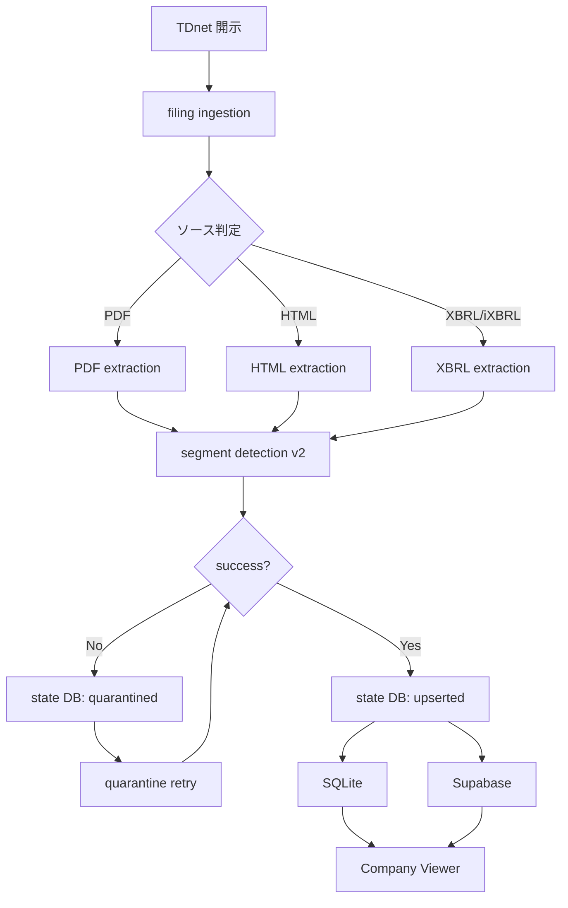
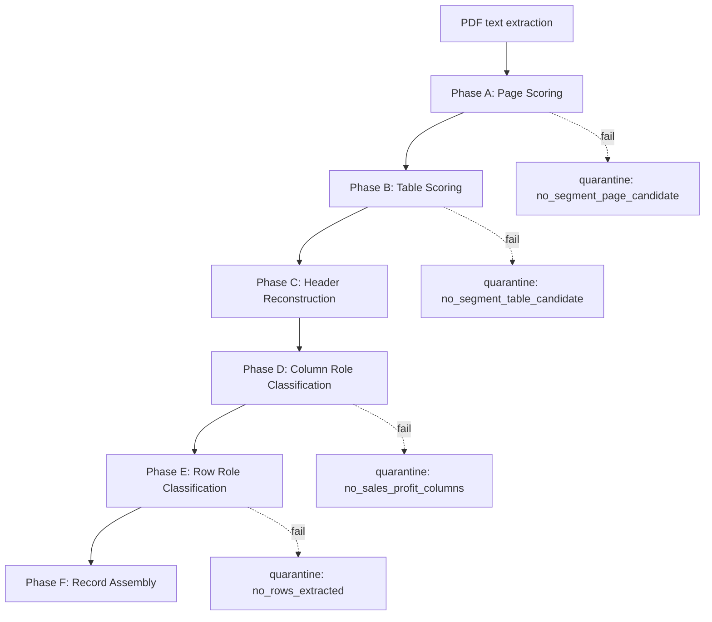

# TDnet Segment Pipeline — Architecture

## データフロー



## コンポーネント一覧

| コンポーネント | ファイル | 役割 |
|---|---|---|
| **Ingestion** | `tools/filings_ingest.py` | TDnet 開示取得 |
| **Processing** | `tools/filings_process.py` | 抽出 + DB 保存 |
| **Segment Detection** | `src/analysis/segment_detection_v2.py` | PDF セグメント表検出 |
| **Header Analysis** | `src/analysis/header_analysis.py` | ヘッダー正規化 + role 判定 |
| **Column Analysis** | `src/analysis/column_analysis.py` | 列 role 分類 |
| **Row Analysis** | `src/analysis/row_analysis.py` | 行 role 分類 |
| **Table Scoring** | `src/analysis/table_scoring.py` | 表候補スコアリング |
| **State Store** | `lib/backfill/state_store.py` | SQLite state DB 管理 |
| **Quarantine Retry** | `tools/retry_quarantine_segments.py` | quarantined 再処理 |
| **Daily Runner** | `tools/pipeline_daily_run.py` | 日次自動実行 |
| **Summary Report** | `tools/pipeline_summary_report.py` | 集計レポート |
| **Pipeline Run** | `tools/pipeline_run.py` | メインエントリポイント |

## Segment Detection v2 処理フロー



## State DB スキーマ

```
filing_states
├── filing_id (PK)
├── ticker
├── status          -- upserted | quarantined | pending
├── review_hint     -- pdf_no_sales_profit_columns etc.
├── source_file
├── created_at
└── updated_at
```

## 改善フェーズ履歴

| Phase | 内容 | 効果 |
|---|---|---|
| 1 | 基本 PDF extraction | 初版 |
| 2 | Header normalization + synonym | 認識率向上 |
| 3 | Column role inference + 隣接昇格 | 列推定精度向上 |
| 4 | Page candidate scoring + KW拡張 | ページ検出改善 |
| 4b | Table candidate scoring + weak evidence | 4件 rescue |
| 5 | Multi-line header + synonym 4th + pair estimation | **88件 rescue** |
| 6 | 運用化 / パイプライン整備 | 本フェーズ |
