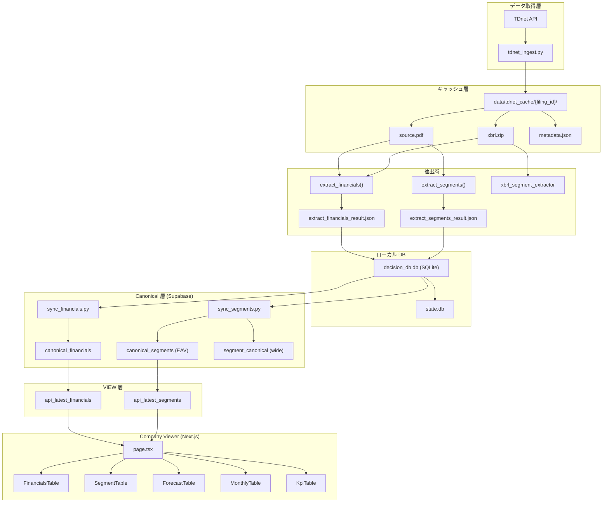
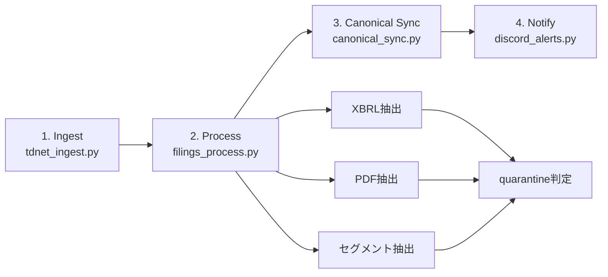

# TDnet Pipeline — System Overview

## アーキテクチャ全体図

## コア技術スタック

| 層 | 技術 |
|---|---|
| 取得 | Python + requests + BeautifulSoup |
| 抽出 | pdfplumber + iXBRL parser |
| ローカルDB | SQLite (decision_db.db / state.db) |
| クラウドDB | Supabase (PostgreSQL) |
| Viewer | Next.js 15 + TypeScript + Supabase JS |
| 通知 | Discord Webhooks |
| スケジューラ | Windows Task Scheduler |

## パイプライン日次フロー

